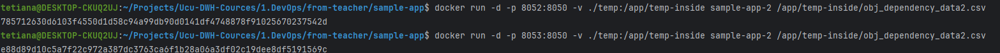
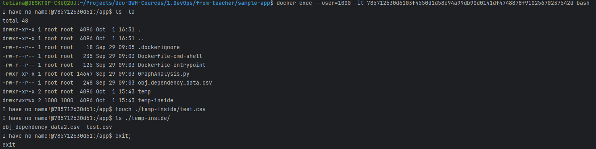
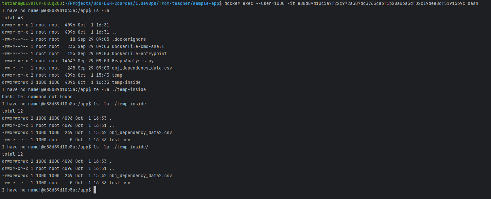
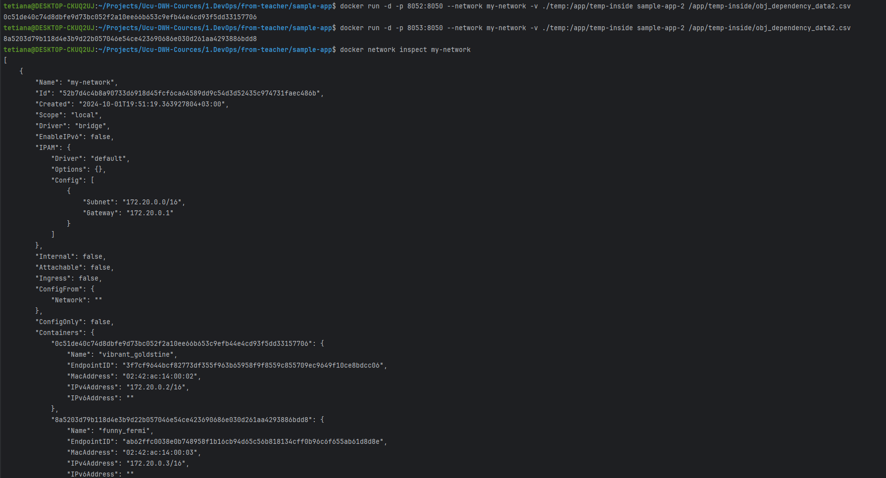

### Lab for second 

#### 4 tasks
Run Sample Application in docker container https://github.com/elisska/devops-helpers/tree/main/sample-app

Build container via `docker build -f Dockerfile -t sample-app .`

Run container via ` docker run -d -p 8051:8050 sample-app`

So as a result we can see in `127.0.0.1:8051` our app

#### 5 tasks
Visualize another data file with Sample application (use bind mounts & entrypoint & cmd combination)

Build container with entry point `docker build -f Dockerfile -t sample-app-2 .`

Then ran a new container with shared data `docker run -it -p 8052:8050 -v ./temp:/app/temp-inside sample-app-2 /app/temp-inside/obj_dependency_data2.csv`

As a result on 8052 host we can see app with modified data

#### 6 tasks
Run 2 containers with volume and prove data sharing

First of all we created 2 new containers:
- `docker run -d -p 8052:8050 -v ./temp:/app/temp-inside sample-app-2 /app/temp-inside/obj_dependency_data2.csv`
- `docker run -d -p 8053:8050 -v ./temp:/app/temp-inside sample-app-2 /app/temp-inside/obj_dependency_data2.csv`

After that I`m going to 1 container to create a file inside shared folder
- `docker exec --user=1000 -it 785712630d6103f4550d1d58c94a99db90d0141df4748878f91025670237542d bash` - go inside
- `touch ./temp-inside/test.csv` - create file
- `ls ./temp-inside/` - show that file created

After that I`m going to 2 container to see that file is present in second container
- `docker exec --user=1000 -it e88d89d10c5a7f22c972a387dc3763ca6f1b28a06a3df02c19dee8df5191569c bash`
- `ls -la ./temp-inside` - show files inside

#### 7 tasks
Run 2 containers in the same network and prove communication between these containers

- `docker network create my-network`
- `docker run -d -p 8052:8050 --network my-network -v ./temp:/app/temp-inside sample-app-2 /app/temp-inside/obj_dependency_data2.csv`
- `docker run -d -p 8053:8050 --network my-network -v ./temp:/app/temp-inside sample-app-2 /app/temp-inside/obj_dependency_data2.csv`
- `docker network inspect my-network`

