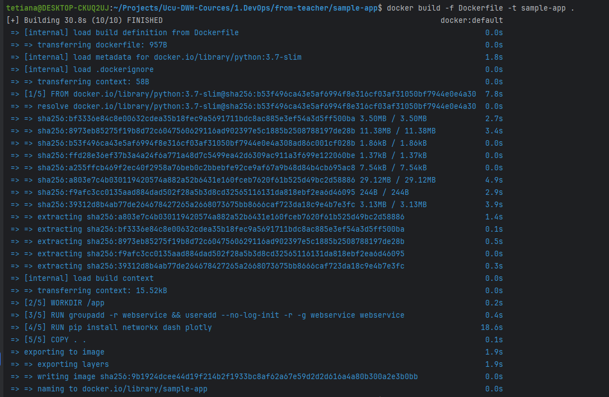
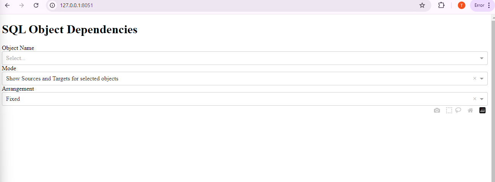
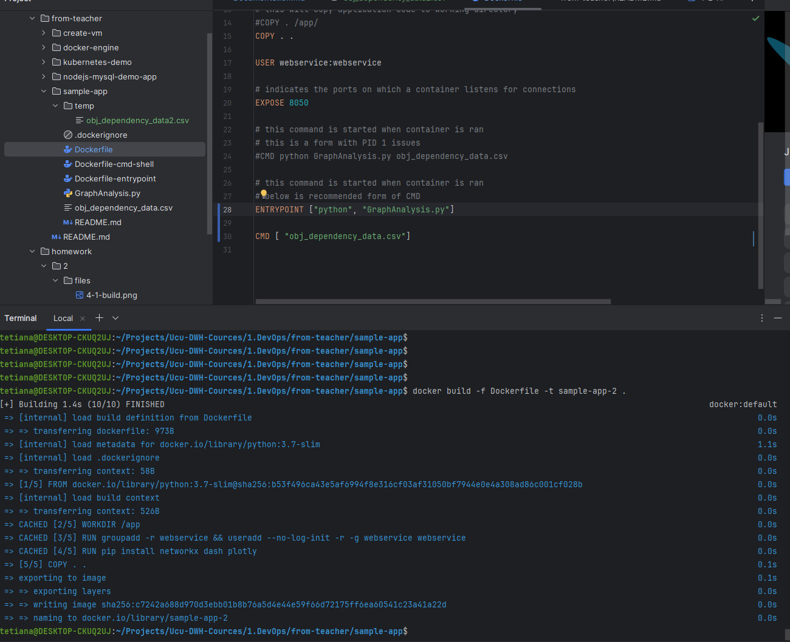
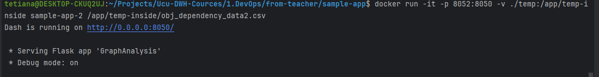
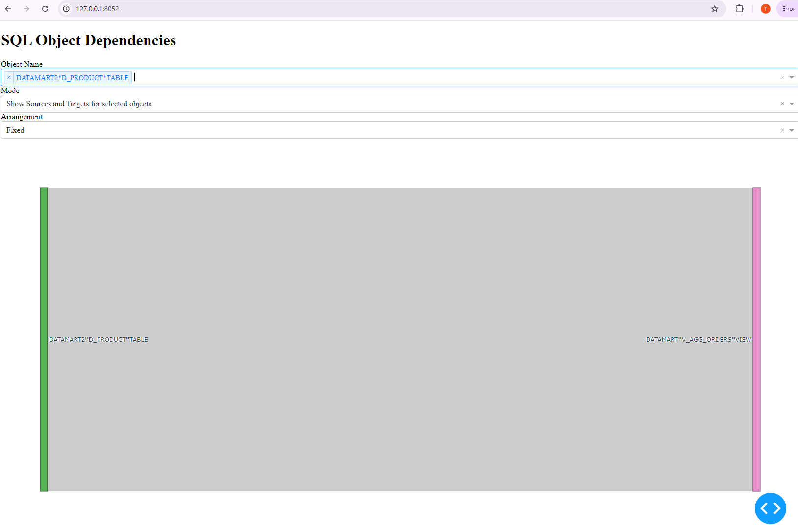

### Lab for second 

#### 4 tasks

Build container via `docker build -f Dockerfile -t sample-app .`

Run container via ` docker run -d -p 8051:8050 sample-app`

So as a result we can see in `127.0.0.1:8051` our app

#### 5 tasks

Build container with entry point `docker build -f Dockerfile -t sample-app-2 .`

Then ran a new container with shared data `docker run -it -p 8052:8050 -v ./temp:/app/temp-inside sample-app-2 /app/temp-inside/obj_dependency_data2.csv`

As a result on 8052 host we can see app with modified data
