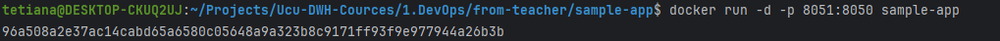

### Lab for second 

#### 4 tasks

Build container via `docker build -f Dockerfile -t sample-app .`

Run container via ` docker run -d -p 8051:8050 sample-app`

So as a result we can see in `127.0.0.1:8051` our app
