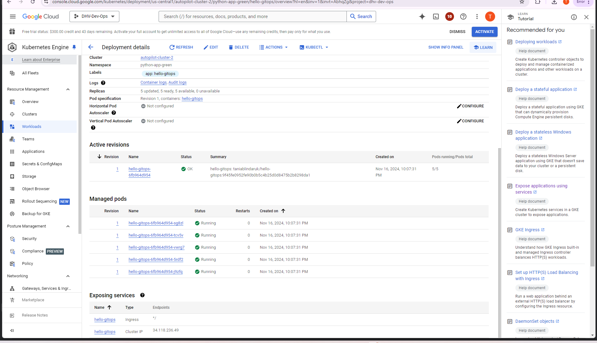

## ● Task 1: Follow ArgoCD GitOps demo & send screenshots with Kubernetes resources from ArgoCD UI on your cluster 

Pls look into folder img/1-task

#### Task 3 (for acceptance): Setup GitHub Actions CI/CD workflow to implement single-service blue/green deployment to any cloud-hosted Kubernetes cluster (EKS, GKE, AKS):

- CI job should include running unit tests for an application and further build & push Docker image to registry

https://github.com/TBlindaruk/github-actions-samples/actions/runs/11872885082/job/33087121509 - it is example of success run

All code could be found https://github.com/TBlindaruk/github-actions-samples

- https://hub.docker.com/repository/docker/taniablindaruk/hello-gitops/general it is docker hub repository

 the is a image with GCP source